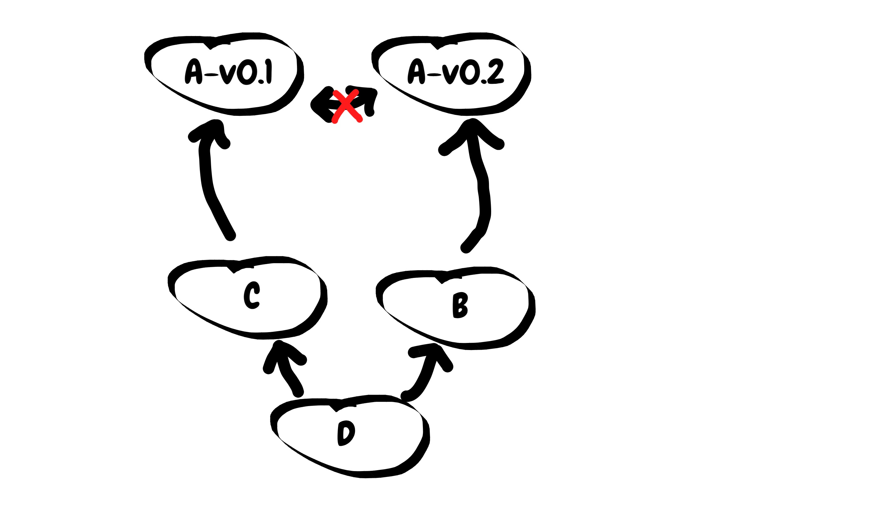
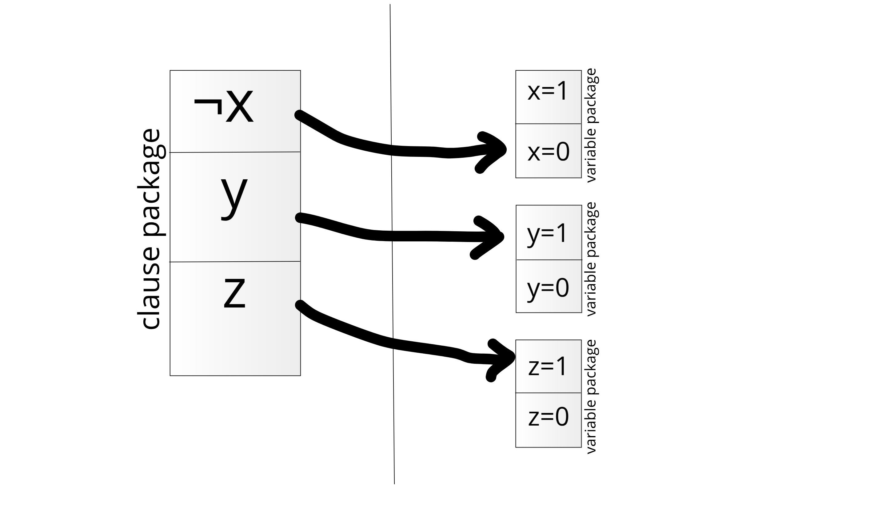

# Dependency Hell is NP-complete

---



---


Why is dependency hell so difficult

+++

You might have heard of
* Do not reinvent the wheel
* Write programs that do one thing and do it well

+++

  Gentoo can apparently do 19 000 things well

---

A notorious environment: npm

* Over 600 000 packages
* About 500 packages a day
* 160 new authors every week

+++

The left-pad insident

+++

* package with 30 lines of code
* 2.5 million downloads per month
* March 2016 - author removes the package

+++

Npm tries to have consistent install with

* One environment per project
* package-lock file

---

Deciding whether dependencies can be met is NP-complete

+++

* Each package has a list of version.
* To install a package all it dependencies must be installed.
* Each version has a different list of dependencies
* Each package should be installed.
* Two different versions of a package cannot be installed at once.

+++

Why cant two different versions be installed at once?

+++

Short answer: Two versions of one package will generally conflict

+++

Proof of NP-completeness

+++

In NP: List of versions as certificate.

+++

Lets say a 3-SAT formula $F$ contains the clause $\lnot x \lor y \lor z$.

+++



---

package managers use SAT solvers

* Debian apt-get
* FreeBSD pkg
* Eclipse plug-in manager
* Anaconda

+++

How?

+++

```
Package: libgtk-3-0
Version: 3.14.5-1+deb8u1
Architecture: i386
...
Depends: libgtk-3-common (>= 3.14.5-1+deb8u1),...
Recommends: hicolor-icon-theme, libgtk-3-bin
Suggests: librsvg2-common, gvfs
Breaks: gnome-themes-standard (<< 3.6),...
...
```

+++

Package-version: $x$

Depends: $y,z$ ; $\lnot x \lor y, \lnot x \lor z$

Breaks: $w$ ; $\lnot x \lor \lnot w$

+++

$ x1 \lor x2 \lor x3 \lor x4 \ldots $

---

Wait a minute, let's just make sure different versions don't conflict...

+++

Better Idea: semver

major.minor.patch

+++

Other Good(tm) ideas:

* vetted repositories
* multiple environments (docker, anaconda, nix)

+++

Unusual ideas:

* monorepo
* package-lock
